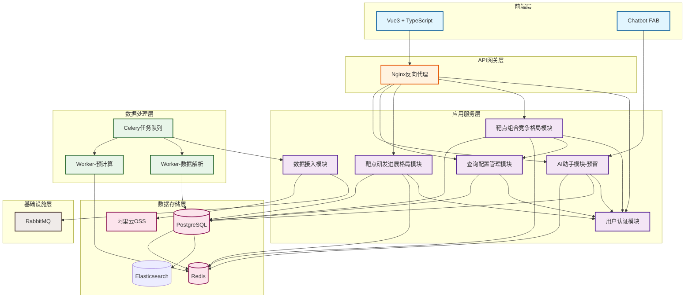
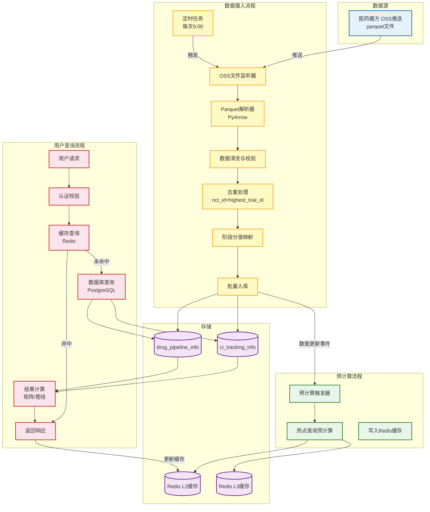
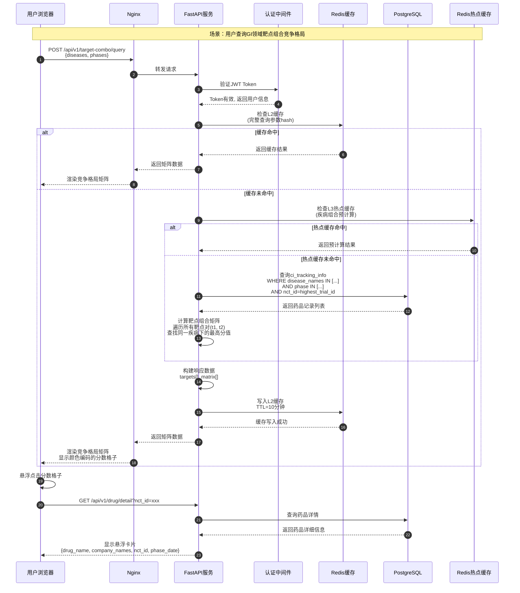
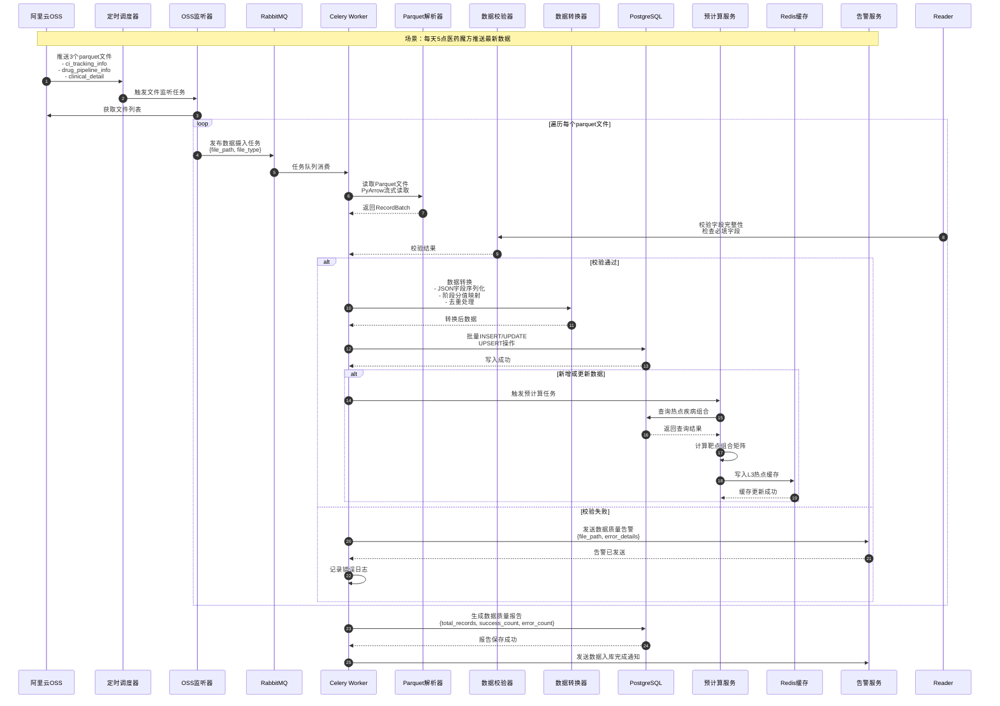

# Mermaid 架构图

## 1. 模块依赖图

## 2. 数据流图

## 3. 关键时序图 - 靶点组合竞争格局查询

## 4. 关键时序图 - 数据摄入与处理

## 使用说明

1. 复制任一图表的 Mermark 代码块
2. 打开 [Mermaid Live Editor](https://mermaid.live/)
3. 将代码粘贴到编辑器中
4. 即可查看渲染后的架构图
